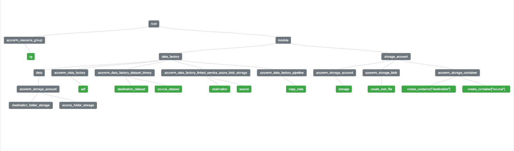

This repository is an Infrastructure as Code (IaC) project that leverages terraform for orchestrating the provisioning of the Azure services related to Data Engineering.

## Prerequisites
1. Azure Account with a subscription
2. Azure CLI
3. Terraform CLI
4. Any IDE of your choice (VS Code, PyCharm, etc.)

## System Architecture

## Project Documentation
Refer Project Documentation.docx for step-by-step implementation
